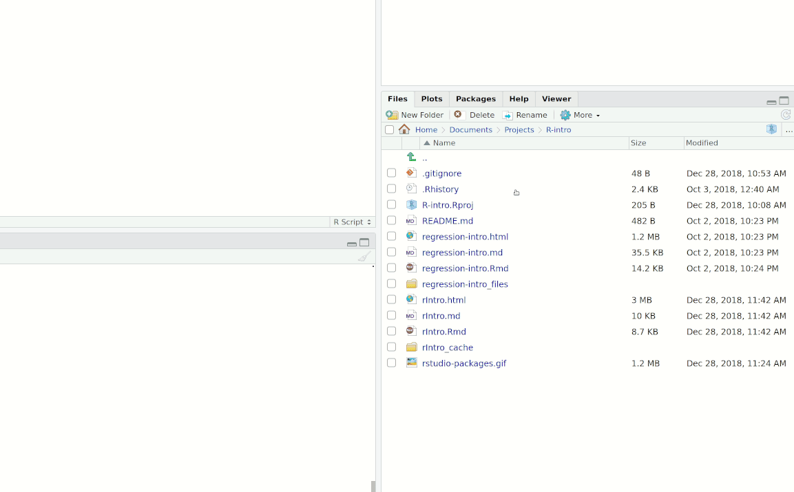

# Installing R

__R:__ To use R, navigate your browser to [cran.r-project.org](https://cran.r-project.org).^[CRAN stands for **C**omprehensive **R** **A**rchive **N**etwork. It is the central repository for downloading R itself and (vetted) packages.] Download. You're ready to use.

__RStudio:__ Most R users interact with R through an (amazing) IDE called "RStudio". Navigate to [https://www.rstudio.com/products/rstudio/](https://www.rstudio.com/products/rstudio/) and download the desktop IDE. Now you're really ready.

# Differences between R and Stata

Relative to Stata, R introduces a few new dimensions:

1. R is free. 
2. R is an object-oriented language, in which objects have types.
3. R uses packages (a.k.a. _libraries_).
4. R tries to guess what you meant.
5. R easily (and infinitely) parallelizes.
6. R makes it easy to work with matrices.
7. R plays nicely with with Markdown.

Let's review these in differences in more depth.

## R is free

Free to use. Free to update and upgrade. Free to dissimenate. Free for your students to install on their _own_ laptops. 

You know the old joke about an economist being told there is a $100 bill lying on the sidewalk? ("Impossible! Someone would have picked it up already.") Now think about the crazy license fees for proprietary econometrics and modelling software. You can see where this is going...

## R is an object-oriented language, in which objects have types

You might have heard or read something along the lines of: "In R, everything has a name and everything is an object". This probably sounds very abstract if you're coming from a language like Stata. However, the key practical implications of this so-called object-oriented (OO) approach are as follows:

- You hold many objects in memory at the same time.
  - This could include multiple data frames, scalars, lists, functions, etc. (Remember: everything in R is an object.)
  - One of the upshots is no more "preserve", "snapshot", "restore" Stata-eque hackery if you want to summarise some variables in your dataset, or have multiple datasets that you want to work on at the same time.
- As a corollary of this, defining or _naming_ objects is a thing:
  - `a <- 3` (_i.e._ the object `a` has been assigned as a scalar — or single-length vector — equal to 3)
  - `b <- matrix(1:4, nrow = 2)` (_i.e._ the object `b` has been assigned as a 2x2 matrix)
  - Side note: the `<-` assignment operator is read aloud as "gets". You can also use a regular old equal sign if you prefer, _e.g._ `a = 3`.
- Object types matter: _e.g._, a `matrix` is a bit different from `data.frame` or a `vector`. [More](http://edrub.in/ARE212/section02.html#data_structures_in_r).

All of this might sound simple -- and it is! -- but one aspect of the OO approach that can trip up new R users (especially those coming from Stata) is that you have to be specific about which object you are referring to. 

- In Stata, because there is only ever one dataset in memory, there can be no ambiguity about which variable you are referring to (or, more correctly, where Stata should look for it). 
- However, because you can have multiple data frames in memory in R, you typically have to tell it that you want the variable "wage" from, say, _dataframe1_ and not from _dataframe2_. 
- There are various ways to do this and it soon becomes second nature. 
  - _E.g._ You could use the `$` index operator: `dataframe1$wage`.
  - _E.g._ Some functions let you specify the data frame (or parent object) as part of the function call. We'll see some practical examples of this approach in the [next section](https://raw.githack.com/grantmcdermott/R-intro/master/regression-intro.html) on regression models.

## R uses packages

- Just as LaTeX uses packages (_i.e._, `\usepackage{foo}`), R also draws upon non-default packages (_i.e._, `library(foo)`).
- Note that R automatically loads with a set of default packages called the `base` installation, which includes the most commonly used packages and functions across all use cases (core probability and statistical operations, linear regression functions, etc.). 
- However, to really become effective in R, you will need to install and use non-default packages too.
  - Seriously, R _intends_ for you to make use of outside packages. Don't constrain yourself.^[If you want to get really _meta_: the `pacman` package helps you... manage packages. [More](https://cran.r-project.org/web/packages/pacman/vignettes/Introduction_to_pacman.html).]

__Install a package:__ `install.packages("package.name")`
  
  - Notice that the installed package's name is in quotes.^[R uses both single (`'word'`) and double quotes (`"word"`) to reference characters (strings).]
  - You generally only need to install a package once. That is, assuming you use the `update.packages()` command to update all of your installed packages at once (see below).

__Load a package:__ `library(package.name)`
  
  - Notice that you don't need quotation marks now. Reason: Once you have installed the package, R treats it as an object rather than a character.
  - You will need to load any non-base package that you want to use at the start of a new R session.
  
__Update packages:__ `update.packages(ask=FALSE)`

  - This command will update all of your installed packages simultaneously. If you want to only update a specific package, you should simply reinstall it (_i.e._ `install.packages("package.name")`)

If you don't feel like typing in these commands manually, one of the many advantages of the RStudio IDE is that makes installing and updating packages very easy (autocompletion, package search, etc.). Just click on the "Packages" tab of bottom-right panel:



## R tries to guess what you meant

R is friendly and tries to help if you weren't specific enough. Consider the following hypothetical OLS regression, where `lm()` is just the workhorse function for linear models in R:

`lm(wage ~ education + gender, data = dataframe1)`

Here, we could use a string variable like `gender` (which takes values like `"female"` and `"male"`) _directly_ in our regression call. R knows what you mean: you want indicator variables for the levels of the variable.^[Variables in R that have different qualitative levels are known as "factors" Behind the scenes, R is converting `gender` from a string to a factor for you, although you can also do this explicitly yourself. [More](https://raw.githack.com/grantmcdermott/R-intro/master/regression-intro.html).]

Mostly, this is a good thing, but sometimes R's desire to help can hide programming mistakes and idiosyncrasies. So it's best to be aware, _e.g._:

```{r}
TRUE + TRUE
```

## `R` easily (and infinitely) parallelizes

Parallelization in R is easily done thanks to various packages like `parallel`, `pbapply`, `future`, and `foreach`.

Let's illustrate by way of a simulation. First we'll create some data (`our_data`) and a function (`our_reg`), which draws a sample of 10,000 observations and runs a regression.

```{R data and function, cache = T}
# Set our seed
set.seed(12345)
# Set sample size
n <- 1e6

# Generate 'x' and 'e'
our_data <- data.frame(x = rnorm(n), e = rnorm(n))
# Calculate 'y'
our_data$y <- 3 + 2 * our_data$x + our_data$e

# Function that draws a sample of 10,000 observations and runs a regression
our_reg <- function(i) {
  # Sample the data
  sample_data <- our_data[sample.int(n = n, size = 1e4, replace = T),]
  # Run the regression
  lm(y ~ x, data = sample_data)$coef[2]
}
```

With our data and function created, let's run the simulation without parallelization:

```{R, no par, cache = T}
library(tictoc) ## For convenient timing

set.seed(1234) ## Optional. (Ensures results are exactly the same.)

tic()
# 1,000-iteration simulation
sim1 <- lapply(X = 1:1e4, FUN = our_reg)
toc()
```

Now run the simulation _with_ parallelization (12 cores):

```{R, with par, cache = T}
library(pbapply) ## Adds progress bar and parallel options

set.seed(1234) ## Optional. (Ensures results are exactly the same.)

tic()
# 1,000-iteration simulation
sim2 <- pblapply(X = 1:1e4, FUN = our_reg, cl = 12)
toc()
```

Not only was this about four times faster^[It's not a full 12 times faster because of the overhead needed to run this code in parallel (among other things). Since this overhead is largely a sunk cost, the relative speed-up will improve as we increase the number of iterations.], but notice how little the syntax changed to run the parallel version. To highlight the differences in bold: <code>**pb**lapply(X = 1:1e4, FUN = our_reg**, cl = 12**)</code>. 

Here's another parallel option just to drive home the point. (In R, there are almost always multiple ways to get a particular job done.) 

```{R, with future, cache = T, message = F}
library(future.apply) ## Another option.
plan(multiprocess) 

set.seed(1234) ## Optional. (Ensures results are exactly the same.)

tic()
# 1,000-iteration simulation
sim3 <- future_lapply(X = 1:1e4, FUN = our_reg)
toc()
```

Further, many packages in R default (or have options) to work in parallel. _E.g._, the regression package `lfe` uses the available processing power to estimate fixed-effect models. 

Again, all of this extra parallelization functionality comes for _free_. In contrast, have you looked up the cost of a Stata/MP license recently? (Nevermind that you effectively pay per core!)

__Note:__ This parallelization often means that you move away from `for` loops and toward parallelized replacements (_e.g._, `lapply` has many parallelized implementations).^[Though there are parallelized `for` loop versions. [More](http://edrub.in/ARE212/section05.html).]

## Working with matrices

Because R began its life as a statistical language/environment, it plays very nicely with matrices.

__Create a matrix:__ 

```{R} 
## The "c()" stands for "concatenate" and is used to bind together a sequence of numbers or strings.
matrix(data = c(3, 2, 3, 5, 9, 4, 3, 2, 7), ncol = 3)
```

__Assign (store) a matrix:__ 

```{R} 
A <- matrix(data = c(3, 2, 3, 5, 9, 4, 3, 2, 7), ncol = 3)
```

__Invert a matrix:__ 

```{R} 
solve(A)
```

## R plays nicely with with Markdown

Notebooks, websites, presentations, etc. can all easily include: 

code chunks,
```{R}
# Some amazing code
a = 2
b = 10
a^(b/a)
```

evaluated code,
```{R}
"Ernie" > "Burt"
```

normal or mathematical text,

$$\left(\text{e.g., }\dfrac{x^2}{3}\right)$$

and even interactive content like `leaflet` maps.

```{r}
library(leaflet)

leaflet() %>%
  addTiles() %>%  # Add default OpenStreetMap map tiles
  addMarkers(lng=-123.075, lat=44.045, popup="The University of Oregon")
```

Yes, Stata 15 has [some Markdown support](https://www.stata.com/new-in-stata/markdown/), but the difference in functionality is [pretty stark](https://rmarkdown.rstudio.com/).

# What's next?

Now that you (hopefully) have a better sense of R, let's head over to the [**regression intro**](https://raw.githack.com/grantmcdermott/R-intro/master/regression-intro.html) section to try some hands-on examples.