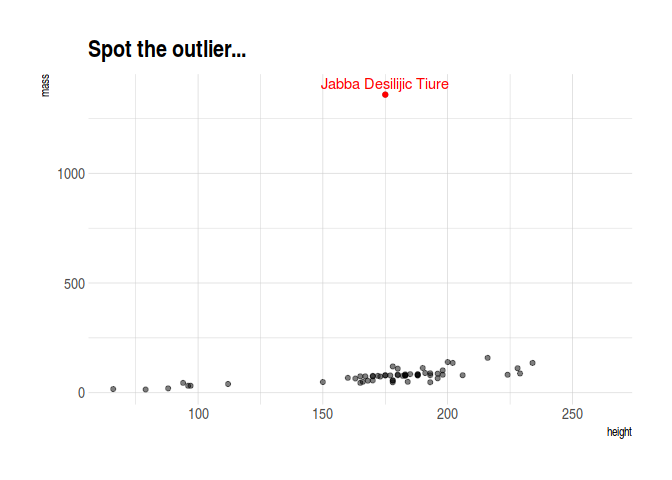
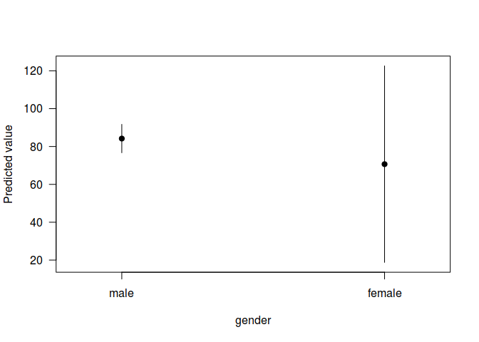

# Packages

Ed has already told you about the importance of packages in R. We're going to be using several packages for this section; both for analysis and the built-in datasets that they provide. None of these are strictly necessary. "Base" R provides all the support you need for basic regression analysis. However, these packages will make it easier and more fun. You can install them all as follows:


```r
install.packages(c("tidyverse", "hrbrthemes", "estimatr", "lfe", "huxtable", "margins"))
```

Once that's done, let's start by loading the `tidyverse`, which is really a bunch of different packages bundled together. We're going to be using the starwars data frame (just for you Ben!), which also comes bundled together with the `tidyverse`. 


```r
library(tidyverse)

starwars
```

```
## # A tibble: 87 x 13
##    name  height  mass hair_color skin_color eye_color birth_year gender
##    <chr>  <int> <dbl> <chr>      <chr>      <chr>          <dbl> <chr> 
##  1 Luke…    172    77 blond      fair       blue            19   male  
##  2 C-3PO    167    75 <NA>       gold       yellow         112   <NA>  
##  3 R2-D2     96    32 <NA>       white, bl… red             33   <NA>  
##  4 Dart…    202   136 none       white      yellow          41.9 male  
##  5 Leia…    150    49 brown      light      brown           19   female
##  6 Owen…    178   120 brown, gr… light      blue            52   male  
##  7 Beru…    165    75 brown      light      blue            47   female
##  8 R5-D4     97    32 <NA>       white, red red             NA   <NA>  
##  9 Bigg…    183    84 black      light      brown           24   male  
## 10 Obi-…    182    77 auburn, w… fair       blue-gray       57   male  
## # ... with 77 more rows, and 5 more variables: homeworld <chr>,
## #   species <chr>, films <list>, vehicles <list>, starships <list>
```

# Regression basics: The `lm()` function

To run an OLS regression in R, we use the `lm()` function that gets automatically loaded with the base `stats` package. The "lm" stands for "**l**inear **m**odels" and running a regression follows a pretty intuitive syntax.[^1] 

```r
lm(y ~ x1 + x2 + x3 + ....)
```

Let's run a simple bivariate regression of starwars characters' mass on their height.


```r
ols1 <- lm(mass ~ height, data = starwars)
# ols1 <- lm(starwars$mass ~ starwars$height) ## Also works
ols1
```

```
## 
## Call:
## lm(formula = mass ~ height, data = starwars)
## 
## Coefficients:
## (Intercept)       height  
##    -13.8103       0.6386
```

The resulting object is pretty terse, but that's only because it buries most of its valuable information --- of which there is a lot --- within its internal list structure. You can use the `str` to view this structure.


```r
str(ols1)
```

```
## List of 13
##  $ coefficients : Named num [1:2] -13.81 0.639
##   ..- attr(*, "names")= chr [1:2] "(Intercept)" "height"
##  $ residuals    : Named num [1:59] -19 -17.8 -15.5 20.8 -33 ...
##   ..- attr(*, "names")= chr [1:59] "1" "2" "3" "4" ...
##  $ effects      : Named num [1:59] -747.47 172.78 -8.92 21.42 -29.44 ...
##   ..- attr(*, "names")= chr [1:59] "(Intercept)" "height" "" "" ...
##  $ rank         : int 2
##  $ fitted.values: Named num [1:59] 96 92.8 47.5 115.2 82 ...
##   ..- attr(*, "names")= chr [1:59] "1" "2" "3" "4" ...
##  $ assign       : int [1:2] 0 1
##  $ qr           :List of 5
##   ..$ qr   : num [1:59, 1:2] -7.68 0.13 0.13 0.13 0.13 ...
##   .. ..- attr(*, "dimnames")=List of 2
##   .. .. ..$ : chr [1:59] "1" "2" "3" "4" ...
##   .. .. ..$ : chr [1:2] "(Intercept)" "height"
##   .. ..- attr(*, "assign")= int [1:2] 0 1
##   ..$ qraux: num [1:2] 1.13 1.03
##   ..$ pivot: int [1:2] 1 2
##   ..$ tol  : num 1e-07
##   ..$ rank : int 2
##   ..- attr(*, "class")= chr "qr"
##  $ df.residual  : int 57
##  $ na.action    : 'omit' Named int [1:28] 12 27 28 33 36 37 38 40 41 43 ...
##   ..- attr(*, "names")= chr [1:28] "12" "27" "28" "33" ...
##  $ xlevels      : Named list()
##  $ call         : language lm(formula = mass ~ height, data = starwars)
##  $ terms        :Classes 'terms', 'formula'  language mass ~ height
##   .. ..- attr(*, "variables")= language list(mass, height)
##   .. ..- attr(*, "factors")= int [1:2, 1] 0 1
##   .. .. ..- attr(*, "dimnames")=List of 2
##   .. .. .. ..$ : chr [1:2] "mass" "height"
##   .. .. .. ..$ : chr "height"
##   .. ..- attr(*, "term.labels")= chr "height"
##   .. ..- attr(*, "order")= int 1
##   .. ..- attr(*, "intercept")= int 1
##   .. ..- attr(*, "response")= int 1
##   .. ..- attr(*, ".Environment")=<environment: R_GlobalEnv> 
##   .. ..- attr(*, "predvars")= language list(mass, height)
##   .. ..- attr(*, "dataClasses")= Named chr [1:2] "numeric" "numeric"
##   .. .. ..- attr(*, "names")= chr [1:2] "mass" "height"
##  $ model        :'data.frame':	59 obs. of  2 variables:
##   ..$ mass  : num [1:59] 77 75 32 136 49 120 75 32 84 77 ...
##   ..$ height: int [1:59] 172 167 96 202 150 178 165 97 183 182 ...
##   ..- attr(*, "terms")=Classes 'terms', 'formula'  language mass ~ height
##   .. .. ..- attr(*, "variables")= language list(mass, height)
##   .. .. ..- attr(*, "factors")= int [1:2, 1] 0 1
##   .. .. .. ..- attr(*, "dimnames")=List of 2
##   .. .. .. .. ..$ : chr [1:2] "mass" "height"
##   .. .. .. .. ..$ : chr "height"
##   .. .. ..- attr(*, "term.labels")= chr "height"
##   .. .. ..- attr(*, "order")= int 1
##   .. .. ..- attr(*, "intercept")= int 1
##   .. .. ..- attr(*, "response")= int 1
##   .. .. ..- attr(*, ".Environment")=<environment: R_GlobalEnv> 
##   .. .. ..- attr(*, "predvars")= language list(mass, height)
##   .. .. ..- attr(*, "dataClasses")= Named chr [1:2] "numeric" "numeric"
##   .. .. .. ..- attr(*, "names")= chr [1:2] "mass" "height"
##   ..- attr(*, "na.action")= 'omit' Named int [1:28] 12 27 28 33 36 37 38 40 41 43 ...
##   .. ..- attr(*, "names")= chr [1:28] "12" "27" "28" "33" ...
##  - attr(*, "class")= chr "lm"
```

So we see that this `ols1` object has a bunch of important slots, containing everything from the regression coefficients, to vectors of the residuals and fitted (i.e. predicted) values, to the design matric rank, to the input data, etc. etc. To summarise the key pieces of information, we can use the --- wait for it --- generic `summary` function. This will look pretty similar to the default regression output from Stata that many of you will be used to.


```r
summary(ols1)
```

```
## 
## Call:
## lm(formula = mass ~ height, data = starwars)
## 
## Residuals:
##     Min      1Q  Median      3Q     Max 
##  -61.43  -30.03  -21.13  -17.73 1260.06 
## 
## Coefficients:
##             Estimate Std. Error t value Pr(>|t|)
## (Intercept) -13.8103   111.1545  -0.124    0.902
## height        0.6386     0.6261   1.020    0.312
## 
## Residual standard error: 169.4 on 57 degrees of freedom
##   (28 observations deleted due to missingness)
## Multiple R-squared:  0.01792,	Adjusted R-squared:  0.0006956 
## F-statistic:  1.04 on 1 and 57 DF,  p-value: 0.312
```

We can then dig down further by extracting a summary of the regression coefficients:


```r
summary(ols1)$coefficients
```

```
##               Estimate  Std. Error    t value  Pr(>|t|)
## (Intercept) -13.810314 111.1545260 -0.1242443 0.9015590
## height        0.638571   0.6260583  1.0199865 0.3120447
```

# Get "tidy" regression coefficients with the `broom` package

While I've just shown you how to extract regression coefficients via the `summary` function, in practice I always use the `broom` package to do so. This package has a bunch of neat features to convert regression (and other statistical) objects into "tidy" data frames. This is especially useful because regression output is so often used as an input to something else, e.g. a plot of coefficients / marginal effects. Here I use the `broom::tidy()` function.


```r
library(broom)

tidy(ols1, conf.int = T)
```

```
## # A tibble: 2 x 7
##   term        estimate std.error statistic p.value conf.low conf.high
##   <chr>          <dbl>     <dbl>     <dbl>   <dbl>    <dbl>     <dbl>
## 1 (Intercept)  -13.8     111.       -0.124   0.902 -236.       209.  
## 2 height         0.639     0.626     1.02    0.312   -0.615      1.89
```

Another useful function is `broom::glance()`, which summarises the model "meta" data (R<sup>2</sup>, AIC, etc.) in a data frame.


```r
glance(ols1)
```

```
## # A tibble: 1 x 11
##   r.squared adj.r.squared sigma statistic p.value    df logLik   AIC   BIC
## *     <dbl>         <dbl> <dbl>     <dbl>   <dbl> <int>  <dbl> <dbl> <dbl>
## 1    0.0179      0.000696  169.      1.04   0.312     2  -386.  777.  783.
## # ... with 2 more variables: deviance <dbl>, df.residual <int>
```


# Wrangling and plotting our data

Our simple model isn't particularly good; our R<sup>2</sup> is only 0.018. Different species and homeworlds aside, we may have an extreme outlier in our midst...


```r
library(hrbrthemes) ## This package just provides the "theme_ipsum" plotting theme that I like

starwars %>%
  ggplot(aes(x=height, y=mass)) +
  geom_point(alpha=0.5) +
  geom_point(
    data = starwars %>% filter(mass==max(mass, na.rm=T)), 
    col="red"
    ) +
  geom_text(
    aes(label=name),
    data = starwars %>% filter(mass==max(mass, na.rm=T)), 
    col="red", vjust = 0, nudge_y = 25
    ) +
  labs(title = "Spot the outlier...") +
  theme_ipsum()
```

```
## Warning: Removed 28 rows containing missing values (geom_point).
```

<!-- -->

You might already have noticed it from the above code chunk, but R (through the `tidyverse`) makes it really easy to wrangle data. One particularly nice feature is the pipe operator: `%>%`. This easily lets us combine objects and functions together in a way that is much easier to read than standard code. For example:


```r
starwars %>%
  arrange(desc(mass)) %>%
  select(name, mass, height)
```

```
## # A tibble: 87 x 3
##    name                   mass height
##    <chr>                 <dbl>  <int>
##  1 Jabba Desilijic Tiure  1358    175
##  2 Grievous                159    216
##  3 IG-88                   140    200
##  4 Darth Vader             136    202
##  5 Tarfful                 136    234
##  6 Owen Lars               120    178
##  7 Bossk                   113    190
##  8 Chewbacca               112    228
##  9 Jek Tono Porkins        110    180
## 10 Dexter Jettster         102    198
## # ... with 77 more rows
```

Maybe we should exclude Jabba from our regression? Remember that we can also keep multiple objects in memory in R, so we can just create a new data frame that excludes him using the `filter` command.


```r
starwars2 <-
  starwars %>% 
  filter(name != "Jabba Desilijic Tiure")
  # filter(!(grepl("Jabba", name))) ## Regular expressions also work

ols2 <- lm(mass ~ height, data = starwars2)
summary(ols2)
```

```
## 
## Call:
## lm(formula = mass ~ height, data = starwars2)
## 
## Residuals:
##     Min      1Q  Median      3Q     Max 
## -39.382  -8.212   0.211   3.846  57.327 
## 
## Coefficients:
##              Estimate Std. Error t value Pr(>|t|)    
## (Intercept) -32.54076   12.56053  -2.591   0.0122 *  
## height        0.62136    0.07073   8.785 4.02e-12 ***
## ---
## Signif. codes:  0 '***' 0.001 '**' 0.01 '*' 0.05 '.' 0.1 ' ' 1
## 
## Residual standard error: 19.14 on 56 degrees of freedom
##   (28 observations deleted due to missingness)
## Multiple R-squared:  0.5795,	Adjusted R-squared:  0.572 
## F-statistic: 77.18 on 1 and 56 DF,  p-value: 4.018e-12
```

Running a regression directly on a subsetted data frame is equally easy.


```r
ols2a <- lm(mass ~ height, data = starwars %>% filter(!(grepl("Jabba", name))))
summary(ols2a)
```

```
## 
## Call:
## lm(formula = mass ~ height, data = starwars %>% filter(!(grepl("Jabba", 
##     name))))
## 
## Residuals:
##     Min      1Q  Median      3Q     Max 
## -39.382  -8.212   0.211   3.846  57.327 
## 
## Coefficients:
##              Estimate Std. Error t value Pr(>|t|)    
## (Intercept) -32.54076   12.56053  -2.591   0.0122 *  
## height        0.62136    0.07073   8.785 4.02e-12 ***
## ---
## Signif. codes:  0 '***' 0.001 '**' 0.01 '*' 0.05 '.' 0.1 ' ' 1
## 
## Residual standard error: 19.14 on 56 degrees of freedom
##   (28 observations deleted due to missingness)
## Multiple R-squared:  0.5795,	Adjusted R-squared:  0.572 
## F-statistic: 77.18 on 1 and 56 DF,  p-value: 4.018e-12
```

The overall model fit is much improved by the exclusion of this outlier, with R<sup>2</sup> increasing to 0.58.

# Robust standard errors

What about robust standard errors? Well, there are *lots* of ways to get these in R. However, my prefered way these days is to use the [`estimatr` package](https://declaredesign.org/r/estimatr/articles/getting-started.html). Let's illustrate with the `ols1` object that we created earlier (which has the crazy Jabba outlier). 


```r
library(estimatr)
```

```
## 
## Attaching package: 'estimatr'
```

```
## The following object is masked from 'package:broom':
## 
##     tidy
```

```r
ols1_robust <- lm_robust(mass ~ height, data = starwars)

tidy(ols1_robust, conf.int = T)
```

```
##          term   estimate   std.error  statistic      p.value    conf.low
## 1 (Intercept) -13.810314 23.45557632 -0.5887859 5.583311e-01 -60.7792950
## 2      height   0.638571  0.08791977  7.2631109 1.159161e-09   0.4625147
##    conf.high df outcome
## 1 33.1586678 57    mass
## 2  0.8146273 57    mass
```

You can also be explicit about using Stata robust standard errors.


```r
library(estimatr)

ols1_robust_stata <- lm_robust(mass ~ height, data = starwars, se_type = "stata")

tidy(ols1_robust, conf.int = T)
```

```
##          term   estimate   std.error  statistic      p.value    conf.low
## 1 (Intercept) -13.810314 23.45557632 -0.5887859 5.583311e-01 -60.7792950
## 2      height   0.638571  0.08791977  7.2631109 1.159161e-09   0.4625147
##    conf.high df outcome
## 1 33.1586678 57    mass
## 2  0.8146273 57    mass
```

# Fixed effects (and dummy variables)

Manually excluding outliers is often a risky strategy (overfitting, etc.). Maybe we should use some fixed effects instead? Again, a manual inspection of the plotted data suggests this could be useful... although the lack of observations per individual species doesn't make this a very robust model.


```r
starwars %>%
  filter(!(grepl("Jabba", name))) %>%
  ggplot(aes(x=height, y=mass, col=species)) +
  geom_point(alpha=0.5) +
  scale_colour_viridis_d() +
  theme_ipsum()
```

```
## Warning: Removed 29 rows containing missing values (geom_point).
```

<!-- -->

## Dummy variables as *factors*

The simplest (and least efficient) way to include fixed effects in a regression model is, of course, to use dummy variables. Compared to other statistical lanaguages (*cough* Stata *cough*), R has a very convenient framework for evaluating dummy variables in a regression: You simply specify the variable of interest as a factor. R will take care of everything else for you.[^2]
 

```r
starwars$species <- as.factor(starwars$species)

ols3 <- lm(mass ~ height + species, data = starwars)
coefs3 <- tidy(ols3, conf.int = T)
summary(ols3)
```

```
## 
## Call:
## lm(formula = mass ~ height + species, data = starwars)
## 
## Residuals:
##     Min      1Q  Median      3Q     Max 
## -23.602  -2.862   0.000   0.000  38.725 
## 
## Coefficients:
##                        Estimate Std. Error t value Pr(>|t|)    
## (Intercept)            -62.0152    18.0474  -3.436  0.00199 ** 
## height                   0.9749     0.1365   7.144 1.38e-07 ***
## speciesBesalisk        -29.0102    26.1282  -1.110  0.27703    
## speciesCerean          -49.0102    26.1282  -1.876  0.07196 .  
## speciesClawdite        -46.7639    23.8009  -1.965  0.06021 .  
## speciesDroid            -4.7174    18.1976  -0.259  0.79750    
## speciesDug              -7.1709    20.9584  -0.342  0.73499    
## speciesEwok             -3.7739    20.5057  -0.184  0.85541    
## speciesGeonosian       -36.3871    24.9077  -1.461  0.15603    
## speciesGungan          -68.7087    25.1755  -2.729  0.01124 *  
## speciesHuman           -30.2375    20.1809  -1.498  0.14609    
## speciesHutt           1249.4119    24.3022  51.412  < 2e-16 ***
## speciesKaleesh          10.4420    27.7217   0.377  0.70947    
## speciesKaminoan        -73.2313    28.9477  -2.530  0.01781 *  
## speciesKel Dor         -41.2614    25.3026  -1.631  0.11501    
## speciesMirialan        -48.6639    21.4881  -2.265  0.03210 *  
## speciesMon Calamari    -30.4624    24.6767  -1.234  0.22807    
## speciesNautolan        -42.0604    25.9594  -1.620  0.11725    
## speciesNeimodian       -34.1861    25.5455  -1.338  0.19240    
## speciesPau'an          -58.8092    26.8203  -2.193  0.03747 *  
## speciesRodian          -32.6383    24.1562  -1.351  0.18829    
## speciesSkakoan         -78.1358    25.7097  -3.039  0.00535 ** 
## speciesSullustan       -25.9649    23.2627  -1.116  0.27456    
## speciesTholothian      -67.3619    24.9857  -2.696  0.01214 *  
## speciesTogruta         -54.5127    24.5253  -2.223  0.03514 *  
## speciesToong           -31.8895    23.4600  -1.359  0.18572    
## speciesTrandoshan      -10.2112    25.4640  -0.401  0.69169    
## speciesTwi'lek         -56.5127    24.5253  -2.304  0.02945 *  
## speciesVulptereen       15.3769    20.5710   0.748  0.46147    
## speciesWookiee         -39.1811    27.2851  -1.436  0.16293    
## speciesYoda's species   14.6734    20.5456   0.714  0.48148    
## speciesZabrak          -28.5881    24.3022  -1.176  0.25011    
## ---
## Signif. codes:  0 '***' 0.001 '**' 0.01 '*' 0.05 '.' 0.1 ' ' 1
## 
## Residual standard error: 14.47 on 26 degrees of freedom
##   (29 observations deleted due to missingness)
## Multiple R-squared:  0.9967,	Adjusted R-squared:  0.9928 
## F-statistic: 255.2 on 31 and 26 DF,  p-value: < 2.2e-16
```

Ignoring the modelling problems that I mentioned above (that insane R<sup>2</sup> is a clear sign we're overfitting because of small within-group samples), this approach works well enough. However, it isn't very efficient or scaleable. What's the point learning all that stuff about the Frisch-Waugh-Lovell theorem, within-group transformations, etcetera, etcetera if we can't use them in our software routines?

## Fixed effects with the `lfe` package

One of my favourite packages in the entire R catalogue is `lfe` ("linear fixed effects"). This package has a tonne of options built in to it (instrumental variables, multi-level clustering, etc.) It can also be used to run simple linear regressions *a la* `lm`. The main functionality, however, is for running fixed effects regressions via the `lfe::felm()` function.[^3]


```r
library(lfe)

ols4 <- felm(mass ~ height | species, data = starwars) ## Fixed effect(s) go after the "|"
coefs4 <- tidy(ols4, conf.int = T)
summary(ols4)
```

```
## 
## Call:
##    felm(formula = mass ~ height | species, data = starwars) 
## 
## Residuals:
##     Min      1Q  Median      3Q     Max 
## -23.602  -2.862   0.000   0.000  38.725 
## 
## Coefficients:
##        Estimate Std. Error t value Pr(>|t|)    
## height   0.9749     0.1365   7.144 1.38e-07 ***
## ---
## Signif. codes:  0 '***' 0.001 '**' 0.01 '*' 0.05 '.' 0.1 ' ' 1
## 
## Residual standard error: 14.47 on 26 degrees of freedom
##   (29 observations deleted due to missingness)
## Multiple R-squared(full model): 0.9967   Adjusted R-squared: 0.9928 
## Multiple R-squared(proj model): 0.6625   Adjusted R-squared: 0.2601 
## F-statistic(full model):255.2 on 31 and 26 DF, p-value: < 2.2e-16 
## F-statistic(proj model): 51.04 on 1 and 26 DF, p-value: 1.38e-07
```

Note that the resulting `felm` object drops all of the species intercepts, since it has abstracted them away as fixed effects. Let's confirm that our main coefficient on "height"" is the same across this and the previous model. (Note the different indexing. Why is that?)


```r
all.equal(coefs3$estimate[2], coefs4$estimate[1])
```

```
## [1] TRUE
```

We could also have used some `dlpyr` syntax, which is more verbose but perhaps easier to read (and less prone to indexing errors).


```r
all.equal(
  coefs3 %>% filter(term == "height") %>% pull(estimate),
  coefs4 %>% filter(term == "height") %>% pull(estimate)
  )
```

```
## [1] TRUE
```

## High-dimensional fixed effects and (multiway) clustering

One reason that I prefer the `lfe` package to other options --- e.g. the panel data-focused `plm` package --- is because it supports high dimensional fixed effects *and* (multiway) clutering.[^4] In the below example, I'm going to add "homeworld" as an additional fixed effect to the model and also cluster according to this model. I'm not claiming that this is a particularly good or sensible model, but maybe the scales of different homeworlds are similarly biased?? Note that, since we specify "homeworld" in the fixed effects slot below, `felm()` automatically converts it to a factor even though we didn't explicitly tell it to.


```r
ols5 <- 
  felm(
    mass ~ height |
      species + homeworld | ## Two fixed effects go here after the first "|"
      0 | ## This is where your IV equation goes, but we put 0 since we aren't instrumenting.
      homeworld, ## The final slot is where we specify our cluster variables
    data = starwars)
coefs5 <- tidy(ols5, conf.int = T)
coefs5
```

```
## # A tibble: 1 x 7
##   term   estimate std.error statistic      p.value conf.low conf.high
##   <chr>     <dbl>     <dbl>     <dbl>        <dbl>    <dbl>     <dbl>
## 1 height    0.756    0.0622      12.2 0.0000000178    0.634     0.878
```

We can easily (visually) compare changes in the coefficients across models thanks to the fact that we saved the output in data frames with `broom::tidy()` above.


```r
bind_rows(
  coefs4 %>% mutate(reg = "Model 4 (LDFE and no clustering"),
  coefs5 %>% mutate(reg = "Model 5 (HDFE and clustering")
  ) %>%
  ggplot(aes(x=reg, y=estimate, ymin=conf.low, ymax=conf.high)) +
  geom_pointrange() +
  labs(Title = "Marginal effect of height on mass") +
  theme_ipsum() +
  theme(axis.title.x = element_blank())
```

<!-- -->

Normally we expect our standard errors to blow up with clustering, but here that effect appears to be outweighted by the increased precision brought on by additional fixed effects. (As suggested earlier, our level of clustering probably doesn't make much sense either.)

# Other topics

## Interaction terms

Like dummy variables, R provides a convenient syntax for specifying interaction terms directly in the regression model without having to create them manually beforehand.[^5] You van just use `x1:x2` (to include only the interaction term) or `x1*x2` (to include the parent terms and interaction terms). Generally speaking, you are best advised to always include the parent terms alongside an interaction term. This makes the `*` option a good default.


```r
humans <- starwars %>% filter(species=="Human")

ols6 <- 
  lm(
    mass ~ gender*height, 
    data = humans
    )

summary(ols6)
```

```
## 
## Call:
## lm(formula = mass ~ gender * height, data = humans)
## 
## Residuals:
##     Min      1Q  Median      3Q     Max 
## -16.250  -8.158  -3.684  -0.107  37.193 
## 
## Coefficients:
##                   Estimate Std. Error t value Pr(>|t|)
## (Intercept)       -61.0000   204.0565  -0.299    0.768
## gendermale        -15.7224   219.5440  -0.072    0.944
## height              0.7333     1.2741   0.576    0.572
## gendermale:height   0.1629     1.3489   0.121    0.905
## 
## Residual standard error: 15.6 on 18 degrees of freedom
##   (13 observations deleted due to missingness)
## Multiple R-squared:  0.4445,	Adjusted R-squared:  0.3519 
## F-statistic: 4.801 on 3 and 18 DF,  p-value: 0.01254
```

## Marginal effects

Caculating marginal effect in a regression is utterly straightforward in cases where there are no non-linearities; just look at the coefficient values! However, that quickly goes out the window when have interaction effects, probit or logit models, etc. Luckily, the `margins` package (which is modeled on its namesake in Stata) goes a long way towards automating the process. You can read more in the [package vignette](https://cran.r-project.org/web/packages/margins/vignettes/Introduction.html), but here's a very simple example to illustrate:


```r
library(margins)

# ols6 %>% margins() %>% summary() ## Piping also works
summary(margins(ols6))
```

```
##      factor     AME      SE      z      p    lower   upper
##  gendermale 13.5253 26.7585 0.5055 0.6132 -38.9203 65.9710
##      height  0.8740  0.4203 2.0797 0.0376   0.0503  1.6977
```
If we want to compare marginal effects at specific values --- e.g. how the ME of height on mass differs across genders --- then that's easily done too.


```r
summary(margins(ols6, at = list(gender = c("male", "female"))))
```

```
##        factor gender      AME      SE       z      p    lower   upper
##  genderfemale 1.0000 -13.5253 26.7585 -0.5055 0.6132 -65.9710 38.9203
##  genderfemale 2.0000 -13.5253 26.7585 -0.5055 0.6132 -65.9710 38.9203
##        height 1.0000   0.8962  0.4431  2.0228 0.0431   0.0278  1.7646
##        height 2.0000   0.7333  1.2741  0.5756 0.5649  -1.7639  3.2306
```

You can also plot it using `margins::cplot()`:


```r
cplot(ols6, x="gender", dx="height")
```

```
##    xvals    yvals     upper    lower
## 1   male 84.19201  91.70295 76.68107
## 2 female 70.66667 122.57168 18.76166
```

<!-- -->

In this case,it doesn't make much sense to read a lot into the larger standard errors on the female group; that's being driven by a very small sub-sample size.

One downside that I want to highlight briefly is that the `margins` package does [not yet work](https://github.com/leeper/margins/issues/73) with `lfe::felm` objects. There are [potential ways](https://stackoverflow.com/questions/30491545/predict-method-for-felm-from-lfe-package) around this, or you can just calculate the marginal effects manually, but it's admittedly a pain.

## Probit, logit and other generalized linear models

See `?stats::glm`.

## Exporting regression results and descriptive tables (LaTeX, etc.)

There are a loads of different options here. I've historically favoured the `stargazer` package (see [here](https://www.jakeruss.com/cheatsheets/stargazer/)), but I also like `pixiedust` (which [parallels](https://cran.r-project.org/web/packages/pixiedust/) the `broom` package) and `huxtable` is a newer package that looks very promising too (see [here](https://hughjonesd.github.io/huxtable/design-principles.html) for a handy comparison of different table "engines" in R). Here's a bare-bones example using the latter, since it works well with Rmarkdown documents.


```r
library(huxtable)

huxreg(ols4, ols5, ols6)
```

<!--html_preserve--><table class="huxtable" style="border-collapse: collapse; margin-bottom: 2em; margin-top: 2em; width: 50%; margin-left: auto; margin-right: auto; ">
<col><col><col><col><tr>
<td style="vertical-align: top; text-align: center; white-space: nowrap; border-style: solid; border-width: 0.8pt 0pt 0pt 0pt; padding: 4pt 4pt 4pt 4pt;"></td>
<td style="vertical-align: top; text-align: center; white-space: nowrap; border-style: solid; border-width: 0.8pt 0pt 0.4pt 0pt; padding: 4pt 4pt 4pt 4pt;">(1)</td>
<td style="vertical-align: top; text-align: center; white-space: nowrap; border-style: solid; border-width: 0.8pt 0pt 0.4pt 0pt; padding: 4pt 4pt 4pt 4pt;">(2)</td>
<td style="vertical-align: top; text-align: center; white-space: nowrap; border-style: solid; border-width: 0.8pt 0pt 0.4pt 0pt; padding: 4pt 4pt 4pt 4pt;">(3)</td>
</tr>
<tr>
<td style="vertical-align: top; text-align: left; white-space: nowrap; padding: 4pt 4pt 4pt 4pt;">height</td>
<td style="vertical-align: top; text-align: right; white-space: nowrap; padding: 4pt 4pt 4pt 4pt;">0.975 ***</td>
<td style="vertical-align: top; text-align: right; white-space: nowrap; padding: 4pt 4pt 4pt 4pt;">0.756 ***</td>
<td style="vertical-align: top; text-align: right; white-space: nowrap; padding: 4pt 4pt 4pt 4pt;">0.733&nbsp;</td>
</tr>
<tr>
<td style="vertical-align: top; text-align: left; white-space: nowrap; padding: 4pt 4pt 4pt 4pt;"></td>
<td style="vertical-align: top; text-align: right; white-space: nowrap; padding: 4pt 4pt 4pt 4pt;">(0.136)&nbsp;&nbsp;&nbsp;</td>
<td style="vertical-align: top; text-align: right; white-space: nowrap; padding: 4pt 4pt 4pt 4pt;">(0.062)&nbsp;&nbsp;&nbsp;</td>
<td style="vertical-align: top; text-align: right; white-space: nowrap; padding: 4pt 4pt 4pt 4pt;">(1.274)</td>
</tr>
<tr>
<td style="vertical-align: top; text-align: left; white-space: nowrap; padding: 4pt 4pt 4pt 4pt;">(Intercept)</td>
<td style="vertical-align: top; text-align: right; white-space: nowrap; padding: 4pt 4pt 4pt 4pt;">&nbsp;&nbsp;&nbsp;&nbsp;&nbsp;&nbsp;&nbsp;&nbsp;</td>
<td style="vertical-align: top; text-align: right; white-space: nowrap; padding: 4pt 4pt 4pt 4pt;">&nbsp;&nbsp;&nbsp;&nbsp;&nbsp;&nbsp;&nbsp;&nbsp;</td>
<td style="vertical-align: top; text-align: right; white-space: nowrap; padding: 4pt 4pt 4pt 4pt;">-61.000&nbsp;</td>
</tr>
<tr>
<td style="vertical-align: top; text-align: left; white-space: nowrap; padding: 4pt 4pt 4pt 4pt;"></td>
<td style="vertical-align: top; text-align: right; white-space: nowrap; padding: 4pt 4pt 4pt 4pt;">&nbsp;&nbsp;&nbsp;&nbsp;&nbsp;&nbsp;&nbsp;&nbsp;</td>
<td style="vertical-align: top; text-align: right; white-space: nowrap; padding: 4pt 4pt 4pt 4pt;">&nbsp;&nbsp;&nbsp;&nbsp;&nbsp;&nbsp;&nbsp;&nbsp;</td>
<td style="vertical-align: top; text-align: right; white-space: nowrap; padding: 4pt 4pt 4pt 4pt;">(204.057)</td>
</tr>
<tr>
<td style="vertical-align: top; text-align: left; white-space: nowrap; padding: 4pt 4pt 4pt 4pt;">gendermale</td>
<td style="vertical-align: top; text-align: right; white-space: nowrap; padding: 4pt 4pt 4pt 4pt;">&nbsp;&nbsp;&nbsp;&nbsp;&nbsp;&nbsp;&nbsp;&nbsp;</td>
<td style="vertical-align: top; text-align: right; white-space: nowrap; padding: 4pt 4pt 4pt 4pt;">&nbsp;&nbsp;&nbsp;&nbsp;&nbsp;&nbsp;&nbsp;&nbsp;</td>
<td style="vertical-align: top; text-align: right; white-space: nowrap; padding: 4pt 4pt 4pt 4pt;">-15.722&nbsp;</td>
</tr>
<tr>
<td style="vertical-align: top; text-align: left; white-space: nowrap; padding: 4pt 4pt 4pt 4pt;"></td>
<td style="vertical-align: top; text-align: right; white-space: nowrap; padding: 4pt 4pt 4pt 4pt;">&nbsp;&nbsp;&nbsp;&nbsp;&nbsp;&nbsp;&nbsp;&nbsp;</td>
<td style="vertical-align: top; text-align: right; white-space: nowrap; padding: 4pt 4pt 4pt 4pt;">&nbsp;&nbsp;&nbsp;&nbsp;&nbsp;&nbsp;&nbsp;&nbsp;</td>
<td style="vertical-align: top; text-align: right; white-space: nowrap; padding: 4pt 4pt 4pt 4pt;">(219.544)</td>
</tr>
<tr>
<td style="vertical-align: top; text-align: left; white-space: nowrap; padding: 4pt 4pt 4pt 4pt;">gendermale:height</td>
<td style="vertical-align: top; text-align: right; white-space: nowrap; padding: 4pt 4pt 4pt 4pt;">&nbsp;&nbsp;&nbsp;&nbsp;&nbsp;&nbsp;&nbsp;&nbsp;</td>
<td style="vertical-align: top; text-align: right; white-space: nowrap; padding: 4pt 4pt 4pt 4pt;">&nbsp;&nbsp;&nbsp;&nbsp;&nbsp;&nbsp;&nbsp;&nbsp;</td>
<td style="vertical-align: top; text-align: right; white-space: nowrap; padding: 4pt 4pt 4pt 4pt;">0.163&nbsp;</td>
</tr>
<tr>
<td style="vertical-align: top; text-align: left; white-space: nowrap; padding: 4pt 4pt 4pt 4pt;"></td>
<td style="vertical-align: top; text-align: right; white-space: nowrap; border-style: solid; border-width: 0pt 0pt 0.4pt 0pt; padding: 4pt 4pt 4pt 4pt;">&nbsp;&nbsp;&nbsp;&nbsp;&nbsp;&nbsp;&nbsp;&nbsp;</td>
<td style="vertical-align: top; text-align: right; white-space: nowrap; border-style: solid; border-width: 0pt 0pt 0.4pt 0pt; padding: 4pt 4pt 4pt 4pt;">&nbsp;&nbsp;&nbsp;&nbsp;&nbsp;&nbsp;&nbsp;&nbsp;</td>
<td style="vertical-align: top; text-align: right; white-space: nowrap; border-style: solid; border-width: 0pt 0pt 0.4pt 0pt; padding: 4pt 4pt 4pt 4pt;">(1.349)</td>
</tr>
<tr>
<td style="vertical-align: top; text-align: left; white-space: nowrap; padding: 4pt 4pt 4pt 4pt;">N</td>
<td style="vertical-align: top; text-align: right; white-space: nowrap; padding: 4pt 4pt 4pt 4pt;">58&nbsp;&nbsp;&nbsp;&nbsp;&nbsp;&nbsp;&nbsp;&nbsp;</td>
<td style="vertical-align: top; text-align: right; white-space: nowrap; padding: 4pt 4pt 4pt 4pt;">55&nbsp;&nbsp;&nbsp;&nbsp;&nbsp;&nbsp;&nbsp;&nbsp;</td>
<td style="vertical-align: top; text-align: right; white-space: nowrap; padding: 4pt 4pt 4pt 4pt;">22&nbsp;&nbsp;&nbsp;&nbsp;&nbsp;</td>
</tr>
<tr>
<td style="vertical-align: top; text-align: left; white-space: nowrap; padding: 4pt 4pt 4pt 4pt;">R2</td>
<td style="vertical-align: top; text-align: right; white-space: nowrap; padding: 4pt 4pt 4pt 4pt;">0.997&nbsp;&nbsp;&nbsp;&nbsp;</td>
<td style="vertical-align: top; text-align: right; white-space: nowrap; padding: 4pt 4pt 4pt 4pt;">0.998&nbsp;&nbsp;&nbsp;&nbsp;</td>
<td style="vertical-align: top; text-align: right; white-space: nowrap; padding: 4pt 4pt 4pt 4pt;">0.444&nbsp;</td>
</tr>
<tr>
<td style="vertical-align: top; text-align: left; white-space: nowrap; padding: 4pt 4pt 4pt 4pt;">logLik</td>
<td style="vertical-align: top; text-align: right; white-space: nowrap; padding: 4pt 4pt 4pt 4pt;">&nbsp;&nbsp;&nbsp;&nbsp;&nbsp;&nbsp;&nbsp;&nbsp;</td>
<td style="vertical-align: top; text-align: right; white-space: nowrap; padding: 4pt 4pt 4pt 4pt;">&nbsp;&nbsp;&nbsp;&nbsp;&nbsp;&nbsp;&nbsp;&nbsp;</td>
<td style="vertical-align: top; text-align: right; white-space: nowrap; padding: 4pt 4pt 4pt 4pt;">-89.456&nbsp;</td>
</tr>
<tr>
<td style="vertical-align: top; text-align: left; white-space: nowrap; border-style: solid; border-width: 0pt 0pt 0.8pt 0pt; padding: 4pt 4pt 4pt 4pt;">AIC</td>
<td style="vertical-align: top; text-align: right; white-space: nowrap; border-style: solid; border-width: 0pt 0pt 0.8pt 0pt; padding: 4pt 4pt 4pt 4pt;">&nbsp;&nbsp;&nbsp;&nbsp;&nbsp;&nbsp;&nbsp;&nbsp;</td>
<td style="vertical-align: top; text-align: right; white-space: nowrap; border-style: solid; border-width: 0pt 0pt 0.8pt 0pt; padding: 4pt 4pt 4pt 4pt;">&nbsp;&nbsp;&nbsp;&nbsp;&nbsp;&nbsp;&nbsp;&nbsp;</td>
<td style="vertical-align: top; text-align: right; white-space: nowrap; border-style: solid; border-width: 0pt 0pt 0.8pt 0pt; padding: 4pt 4pt 4pt 4pt;">188.911&nbsp;</td>
</tr>
<tr>
<td colspan="4" style="vertical-align: top; text-align: left; white-space: normal; padding: 4pt 4pt 4pt 4pt;"> *** p &lt; 0.001;  ** p &lt; 0.01;  * p &lt; 0.05.</td>
</tr>
</table>
<!--/html_preserve-->


# Further reading

- Ed Rubin has outstanding notes for a [PhD-level econometrics course](http://edrub.in/ARE212/notes.html) on his website. I believe that he is turning these notes into a book with some coauthors, so stay tuned for that too.

[^1]: Indeed, all other regression packages in R that I'm aware of --- including those that allow for much more advanced and flexible models --- closely follow the `lm` syntax.

[^2]: No need to tabulate/append a whole new matrix of binary variables.

[^3]: There are other packages for running panel regressions in R, in particular the `plm` package. However, I think that `lfe` supersedes these in virtually all aspects.

[^4]: It is very similar to the excellent [reghdfe](http://scorreia.com/software/reghdfe/) package in Stata.

[^5]: Although there are very good reasons that you might want to modify your parent variables before doing so (e.g. centering them). As it happens, I'm [on record](https://twitter.com/grant_mcdermott/status/903691491414917122) as stating that interaction effects are most widely misunderstood and misapplied concept in econometrics. However, that's a topic for another day. (Read the paper in the link!)
